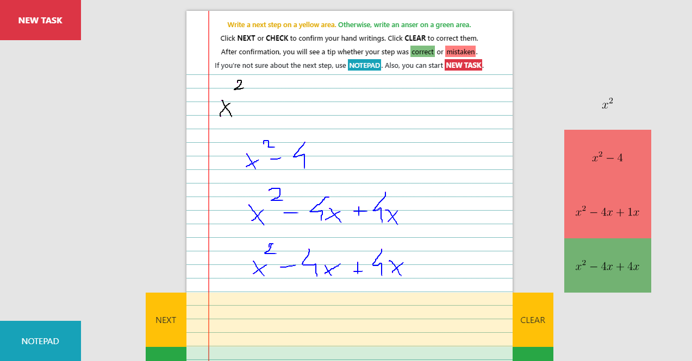

# Charakterystyka  oprogramowania 

### Nazwa skrócona: 
Thinkz
### Nazwa pełna: 
System wspierania edukacji szkolnej Thinkz.
### Dokumentacja rozszerzona:
Dostępna pod linkiem: https://github.com/hubertkolcz/Thinkz-Preview/blob/master/Thinkz%20-%20AIS%20-%20Documentation.pdf
### Krótki opis ze wskazaniem celów
Nauka jest o wiele bardziej efektywna, gdy nauczyciel pracuje indywidualnie z uczniem. Prywatne korepetycje są jednak drogie i nie dla każdego są dostępne. W dużych klasach nauczyciele nie są w stanie skupić się na indywidualnych potrzebach każdego ucznia i trudno jest zapewnić indywidualny tok nauczania. Z drugiej strony, znaczna liczba uczniów nie może uczęszczać do standardowych szkół, ponieważ nie są one przystosowane do przyjmowania uczniów niepełnosprawnych.

Aby zmienić ten stan w aspekcie społecznym, powinno się znaleźć rozwiązanie, które spełniałoby kilka aspektów. Niektóre z nich to: zapewnienie przystępnej cenowo i efektywnej edukacji dla każdego bez względu na status finansowy; zminimalizowanie wpływu niekontrolowanych czynników, takich jak pochodzenie i naturalne predyspozycje, na przyszłość dzieci i dostęp do zasobów; zapewnienie wsparcia ambitnym i pracowitym nastolatkom, którzy cierpią z powodu upośledzenia lub pochodzą z nieuprzywilejowanych środowisk; skrócenie czasu, jaki młodzi ludzie spędzają na realizacji podstawy programowej w szkole, aby mogli poświęcić więcej czasu na zgłębianie swoich zainteresowań; uwolnienie nauczycieli od zbędnej pracy, aby mogli poświęcić więcej indywidualnej uwagi swoim uczniom i pomóc im w odnalezieniu pasji i określeniu celów zawodowych.

Propozycją rozwiązania, które spełnia wymienione kryteria i jest głównym tematem niniejszego dokumentu, jest system, który rozpoznaje i koryguje odręczne notatki w czasie rzeczywistym. Wskazuje on błędy użytkownika na ekranie urządzeń elektronicznych, wykorzystując zalety Internetu Rzeczy i rozwiązań chmury obliczeniowej.

### Prawa autorskie 
Hubert Kołcz - CC 3.0

### Autorzy
Hubert Kołcz - programista/wizjoner
(w przeszłości: Mateusz Kusiak, Mateusz Łukasiński, Weronika Jóźwiak, 
Damian Jaszewski,  Piotr Chodoła)

### Warunki licencyjne do oprogramowania wytworzonego przez grupę
CC 3.0

#### Wymagania funkcjonalne

|Identyfikator|Nazwa krótka|      Opis   | Priorytet |
|-------------|-----------|-------------|-------------|
|1.| Sprawdzanie poprawności obliczeń | System weryfikuje obliczenia |1|
|2.| Możliwość tworzenia notatek | Aplikacja umożliwia zapisywanie wyrażeń 'na brudno'.| 1 |
|3.| Gumka | Użytkownik ma możliwość usuwania zapisywanych przez siebie wyrażeń | 1 |
|4. | Przekształcanie zapisków odręcznych na postać LaTeX | Użytkownik, po wprowadzeniu wyrażenia odręcznie, otrzyma ją w postaci LaTeX | 2 |
|5. | System podpowiedzi | System podpowiada, czy to co użytkownik wpisał jest poprawne, za pomocą koloowych monitów | 2|

#### Wymagania niefunkcjonalne

|Identyfikator| Nazwa krótka| Opis |Priorytet|
|--------------|------------|------------|----------|
|1.| Wieloplatformowość| Strona jest responsywna i umożliwia sprawdzenie funkcjonalności zarówno na ekranie telefonu, tabeltu i komputera | 3|
|2.| Użyteczność | Interfejs jest intuicyjny |1|
|3.| Bezpieczeństwo | Dane użytkownika nie są zapisywane |2|
|4.| Dostępność | Dostęp do aplikacji w dowolnym momencie | 1|
|5.| Wydajność | Szybkość reakcji aplikacji na zapytania | 1|

### Architektura oprogramowania
| Front-end                                                       | Back-end                          | Handwritten Text Recognition + Calculation                                  | Azure services                       |
|-----------------------------------------------------------------|-----------------------------------|-----------------------------------------------------------------------------|--------------------------------------|
| HTML5, Bootstrap (CSS framework), jQuery (JavaScript framework) | Flask (Python web framework), C++ | Seshat (HWR), C++ latex2sympy (parser, Python) SymPy (math library. Python) | Azure Virtual Machine (Ubuntu 18.04) |

### Funkcjonalności prototypu:
Aplikacja symulująca kartkę papieru, na której użytkownik rozwiązuje zadania matematyczne pod nadzorem wirtualnego korepetytora. System weryfikuje każdy krok, dając informacje czy to co użytkownik wpisał w następnym kroku jest równoważne do poprzedniego. Jeśli tak, pojawia się komunikat na zielono. Jeśli popełnił błąd - na czerwono. 
Jeżeli użytkownik wpisze rozwiązanie poprawnie, zostanie o tym poinformowany.

### Przykład użycia
Obecnie moduł matematyczny działa bez konieczności korzystania z urządzenia zewnętrznego. Możliwe jest korzystanie z modułu bezpośrednio z komputera, tabletu lub telefonu komórkowego. Po przekierowaniu na stronę internetową, pierwszym krokiem jest zapisanie równania, które użytkownik chce rozwiązać, np.
X^2 = x. Następnie użytkownik powinien wpisać kolejny krok, który prowadzi do rozwiązania równania. Na przykład, x^2 - x = 0.
System rozpozna, że równania są równoważne i pozwoli użytkownikowi kontynuować rozwiązywanie zadania.
problemu. (x-1)x=0 również zostanie rozpoznane jako poprawne przekształcenie. Jeśli użytkownik popełni błąd, na przykład, jeśli wprowadzi (x-1)x+1=0, zostanie o tym automatycznie poinformowany, tak aby można było szybko naprawić jego błąd. Jeśli użytkownik wpisze poprawny wynik w przeznaczonym do tego polu, np. jeśli wskaże, że x=1 i x=0 rozwiązują równanie, zostanie o tym powiadomiony. Alternatywnie, zostanie poinformowany o błędnych wynikach.

